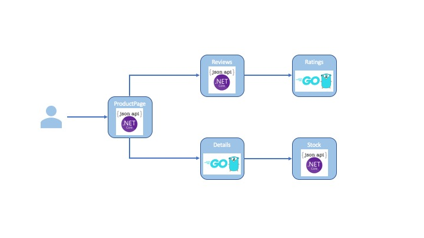
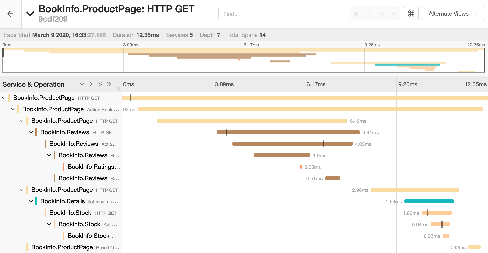

Kiali's demo application rewritten in C# and Golang

To get Jaeger working, simply run 

`docker run -d -p 6831:6831/udp -p 16686:16686 jaegertracing/all-in-one:latest`

Application topology:

Example Jaeger trace:

